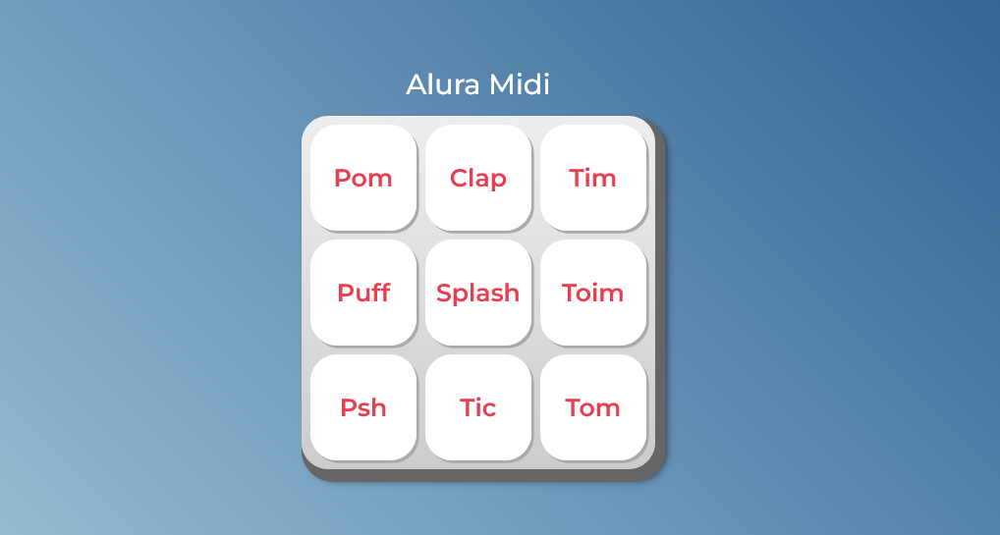

# Teclado Midi
Script desenvolvido como atividade prática para o Programa Boticário Desenvolve 2024.
Os arquivos HTML e CSS do projeto foram desenvolvidos e previamente disponibilizados pela Alura. 

 

## 💡 Sobre o Projeto
O projeto foi um exercício sugerido no curso de formação front-end ["JavaScript para Web: Crie páginas dinâmicas"](https://cursos.alura.com.br/course/javascript-web-paginas-dinamicas), oferecido na trilha de formação do Programa Boticário Desenvolve 2024. O curso teve conteúdo com total de 10 horas. 

A atividade consistia em desenvolver ums script responsável por identificar o pressionamento de botões em um site e, então, reproduzir sons para cada botão. Durante o desenvolvimento do script, aprendi a associar o javaScript com elementos do DOM, e me familiarizei com o uso funções e métodos.

## 💻 Tecnologias
Este projeto foi desenvolvido com as seguintes linguagens e ferramentas:
- JavaScript
